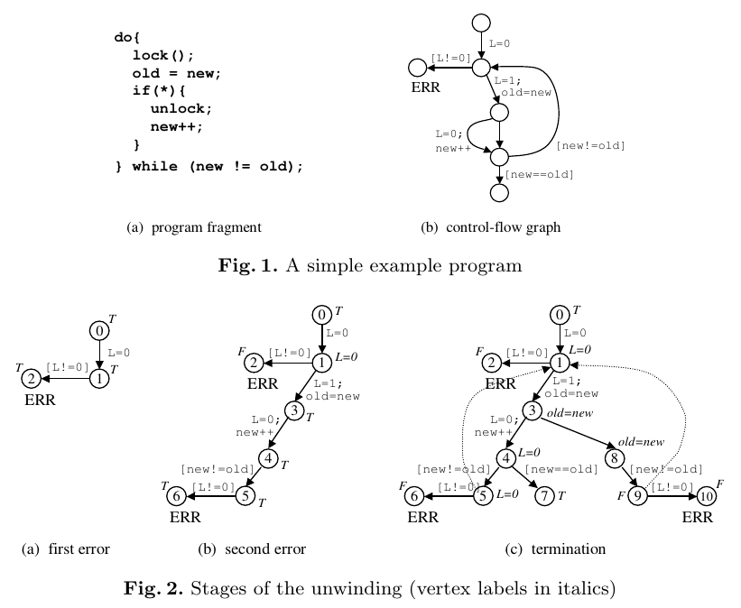

The purpose of the project report is to convey clearly the problem you addressed, the work you did, and the results. It should include at least the following content (section headings can vary according to the nature of project):
The report should be 5-10 pages (excluding references) with an 11pt font.  (Naturally, if there is no software artifact attached to your project and the report is your main deliverable, your report should be longer).  Keep your writing precise, use figures and small illustrative examples liberally, and tables where appropriate.  Feel free to add an appendix for extended details.

## Introduction

In his 2006 paper “Lazy Abstraction with Interpolants”, K. L. McMillian describes a new algorithm for model checking infinite-state sequential programs using Craig interpolation and lazy abstraction.
For our final project we implemented the algorithm he describes using Python 3.
Our primary reason for choosing this algorithm is personal interest.
For assignment 4 in the class we implemented more basic model checkers, and in many ways this project was a continuation of that assignment.
We chose Python 3 for several reasons:
Python is commonly used in academia for its readability, compactness, and flexibility.
It has well-supported bindings for the Z3 Theorem prover, which we have used for our assignments in class.
By using Python we can also reuse existing parsing infrastructure provided to us for assignment 4, which was also written in Python.

% <TODO section on benefits of lazy abstraction vs other models? If so, in introduction or overview?>

## Overview
### Tools and Architecture
There are 3 main features required for this system.
First, the program must be capable of parsing a program into an easily manipulable form. (In this case, a CFA.)
Second, the program must be capable of generating interpolants between vertices in the CFA.
Most importantly, the program must be capable of using the generated interpolants to % <TODO “DO THE THING”>
While the core objective of the project was to implement the last part, the system as a whole would only work if all three were implemented.
To this end, we reused the given code for assignment 4 for the program parsing, and used Z3 for interpolants.
Unfortunately, modern Z3 no longer supports interpolant generation, so we included in our project an older version of Z3 with some modifications and bugfixes to suit our needs.

### Algorithm Overview % <TODO move to beginning of project tasks?>
At a high level, the Lazy Abstraction algorithm unwinds the CFA into a tree, and gives each location a label. 
Initially this label is always True.
The algorithm incrementally expands the tree while using interpolants to strengthen the labels as necessary until a path to the error state is found, or the tree can no longer be expanded.

{ width=70% }

To this end, McMillian describes 3 main functions to implement: Expand, Refine, and Cover.
Expand adds more vertices to the tree corresponding to possible transitions from a given vertex.
Refine is only called on error states.
By generating an interpolant between each vertex in the path from the root of the tree to an error state, Refine strengthens the labels for every vertex in the path, proving the error state is unreachable.
If an interpolant cannot be found, the error state must be reachable, and the program is unsafe.
% <TODO clarify craig interpolants vs reverse interpolants?>
Cover is called on any vertex that represents the same location in the tree as one of its ancestors while modeling the same state.
By covering vertices whenever possible, we ensure that the algorithm does not take an infinite amount of time to run on programs with an infinite loop.
When a vertex is covered, it will not be expanded any further in the tree.
When there are no more uncovered leafs, the algorithm has finished, and the program is declared safe.

## Project Tasks
Our project design went through several iterations as the semester went on.
We originally planned to implement the algorithm in Rust due to personal interest, but as we examined tooling options and library support we switched to Ocaml, and eventually Python.

### Individual Contributions
Almost all of the programming occurred with both of us present and actively participating.
We most frequently pair programmed, occasionally concurrently working on independent functions and merging with version control.
A surprisingly large portion of the project was spent just deciphering and understanding the paper itself, the other papers it builds on and references, and other related works and prerequisites. 
Fortunately the paper included pseudocode for all of the primary functions.
As we went we found translating the pseudocode into a skeleton Python program to be a helpful and productive exercise to build understanding on.
Andrew built out most of the initial skeleton as well as other bulk operations such as adding MyPy annotations and building infrastructure for proper logging.
Perry added code for covering/uncovering vertices, assorted tests and helper functions, and a number of bug fixes.
Perry also wrote the initial draft text for the final paper, which was subsequently revised and further developed by Perry and Andrew together.
The project presentation was also developed collaboratively, with slides distributed by topic.
Perry wrote the slides summarizing Expand, Refine, and Conquer Cover, as well as <TODO> while Andrew worked on <TODO>
% <TODO project presentation work distribution? I can’t remember who did what but we can definitely figure this out from the version history.>

The most challenging part of the assignment, besides understanding the paper, was <TODO whatever bug we’re trying to figure out now happens to end up being?>

## Results
We are pleased to say that our implementation is complete and works correctly.
<TODO explain how we set error states and sample input/output, once that’s ironed out.>
To test our implementation we used a variety of tests including the tests from assignment 4, the example code mentioned in the paper, and custom tests we developed ourselves, which can be found in <TODO the appendix>.
Many of our tests are near duplicates of each other, with slight variations to trigger differing patterns in the generated CFA.
For example, one test may execute a piece of code 3 times before exiting, while another contains a single error that causes it to loop indefinitely.
This was one of the ways we verified that covering worked correctly.
In addition, our code contains liberal use of assertion statements to verify that the code is behaving as expected. <TODO is this sentence too unnecessary?>

## Discussion
% <Note: I don’t see a huge difference between this prompt and the one before it, so I’m approaching it as more of a “lessons learned” section.>

Some of the biggest lessons we learned from this project had little to do with the code itself.
To begin with, we experienced firsthand how useful a language like Python can be when implementing pseudocode.
After all, Python is not too far off.
More importantly, we learned how helpful pseudocode is in the context of academic papers.
Understanding the algorithm was much more straightforward once we just focused on deciphering the pseudocode.
On the other hand, we found the terseness to be challenging at times - because the pseudocode in the paper made heavy use of symbols rather than semantically useful words, we had to backtrack many times while reading the papers to learn how McMillian intended to use the symbols.

From a code standpoint, one major takeaway is that <TODO “We shouldn’t do whatever caused our bugs”>

## Conclusions
In this project we successfully implemented Lazy Abstraction with Interpolants, an algorithm designed by K. L. McMillian for faster model checking of programs with infinite state.
Our code is written in Python, and includes tests and a patched version of Z3.
<TODO summary of most difficult bug?>

<TODO possible future direction, idk what yet>

## Installation
Requirements:
Python 3.5 or greater
Our fork of z3. Set PYTHONPATH=z3/build/python, and LD\_LIBRARY\_PATH=z3/build before executing.

